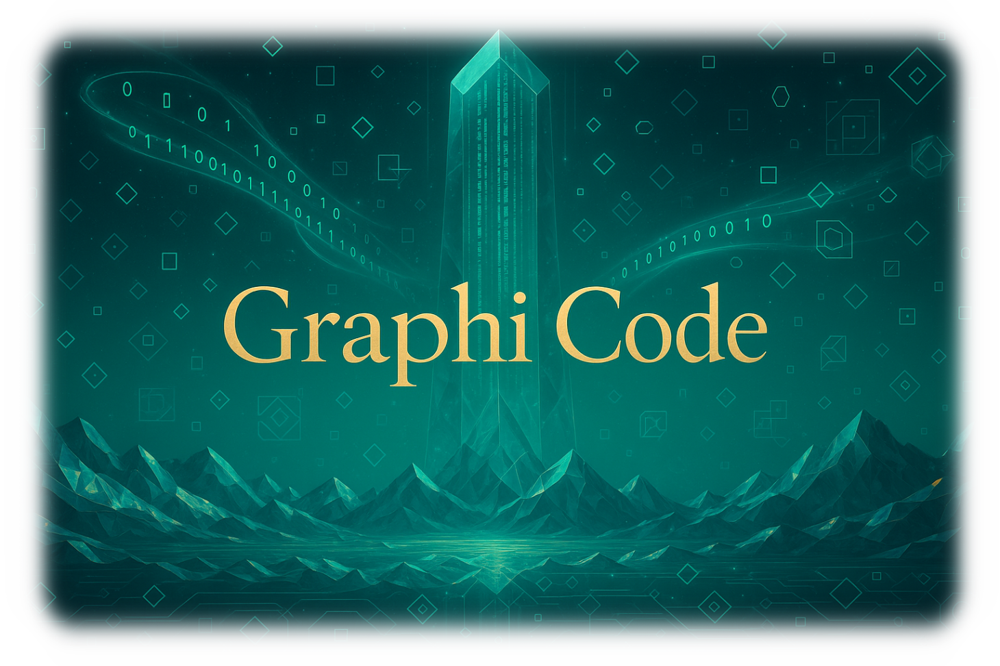

<div align="center">



# 🎨 Graphi Code

[](https://nextjs.org/)
[](https://reactjs.org/)
[](https://www.typescriptlang.org/)
[](https://tailwindcss.com/)

**リアルタイムプレビュー機能付きHTML エディター**

和モダンデザインを採用した、直感的で美しいコーディング体験を提供します

[🚀 **デモを試す**](https://sunwood-ai-labs.github.io/graphi-code/) | [📖 **機能紹介**](#-機能) | [⚡ **クイックスタート**](#-クイックスタート)


</div>

---

## ✨ 機能

### 🔥 **リアルタイムプレビュー**
- コード変更が即座にプレビューに反映
- 遅延なしの滑らかな更新

### ✏️ **インライン編集**
- プレビュー画面で直接テキスト編集
- WYSIWYG感覚でHTMLを編集

### 🌙 **テーマ切り替え**
- **涼雅テーマ（ライト）**: 清涼感のある青緑基調
- **夜涼テーマ（ダーク）**: 落ち着いた夜の雰囲気

### 📱 **レスポンシブデザイン**
- デスクトップ・タブレット・モバイル対応
- 画面サイズに応じた最適なレイアウト

### 🎨 **和モダンデザイン**
- 日本の美意識を取り入れたUI
- 青海波パターンや星空エフェクト
- 美しいアニメーションとトランジション

---

## ⚡ クイックスタート

### 📋 前提条件
- Node.js 18以上
- npm または yarn

### 🚀 インストール

```bash
# リポジトリをクローン
git clone https://github.com/Sunwood-ai-labs/graphi-code.git

# ディレクトリに移動
cd graphi-code

# 依存関係をインストール
npm install

# 開発サーバーを起動
npm run dev
```

ブラウザで `http://localhost:3000` を開いてください。

### 📦 ビルド・デプロイ

```bash
# 本番用ビルド
npm run build

# 静的ファイル生成（GitHub Pages用）
npm run export
```

---

## 📖 使用方法

### 基本操作

1. **📝 コード編集**: 左側のエディターでHTMLコードを編集
2. **👀 プレビュー確認**: 右側でリアルタイムプレビューを確認
3. **✏️ 直接編集**: プレビュー画面の要素をクリックして直接編集
4. **🌙 テーマ変更**: ナビゲーションのテーマボタンで切り替え
5. **📂 ファイル読み込み**: インポートボタンでHTMLファイルを読み込み

### エディター機能

- **シンタックスハイライト**: HTML構文の色分け表示
- **自動補完**: タグの自動クローズ
- **行番号表示**: コードの行数表示
- **フォールディング**: コードブロックの折りたたみ

### プレビュー機能

- **編集可能要素**: `p`, `h1-h6`, `li`, `span`, `strong`, `em` などが直接編集可能
- **リアルタイム同期**: プレビューでの編集がエディターに即座に反映
- **スタイル適用**: CSS変数による美しいスタイリング

---

## 🏗️ プロジェクト構造

```
graphi-code/
├── 📂 src/
│   ├── 📂 app/                    # Next.js App Router
│   │   ├── 📄 layout.tsx          # ルートレイアウト
│   │   ├── 📄 page.tsx            # メインページ
│   │   └── 📄 globals.css         # グローバルスタイル
│   └── 📂 components/             # Reactコンポーネント
│       ├── 📄 HtmlEditor.tsx      # CodeMirrorエディター
│       ├── 📄 LivePreview.tsx     # プレビュー画面
│       └── 📄 Navbar.tsx          # ナビゲーション
├── 📂 .github/workflows/          # GitHub Actions
├── 📄 next.config.js              # Next.js設定
├── 📄 tailwind.config.js          # TailwindCSS設定
└── 📄 package.json                # 依存関係定義
```

## 🛠️ 技術スタック

### フロントエンド
- **⚛️ React 18**: モダンなUI構築
- **🔷 TypeScript**: 型安全な開発
- **⚡ Next.js 14**: フルスタックReactフレームワーク（App Router）

### スタイリング
- **🎨 TailwindCSS**: ユーティリティファーストCSS
- **🎭 CSS Variables**: テーマ切り替え対応
- **📱 Responsive Design**: モバイルファースト設計

### エディター
- **📝 CodeMirror 6**: 高性能コードエディター
- **🎯 HTML Language Support**: シンタックスハイライト
- **🔄 Real-time Sync**: リアルタイム同期機能

### デプロイ・CI/CD
- **🚀 GitHub Pages**: 静的サイトホスティング
- **⚙️ GitHub Actions**: 自動ビルド・デプロイ
- **📦 Static Export**: 静的ファイル生成

---

## 🎨 デザインコンセプト

### 涼雅（りょうが）テーマ
- **基調色**: 深い青緑 (#025E73)
- **アクセント**: 明るい青緑 (#04BFAD)
- **背景**: 清涼感のある白基調
- **パターン**: 青海波（せいがいは）模様

### 夜涼（やりょう）テーマ
- **基調色**: 明るいシアン (#66D9EF)
- **アクセント**: 金色 (#F2C166)
- **背景**: 深い夜空の青
- **エフェクト**: 星空パターン

---

## 🤝 コントリビューション

プロジェクトへの貢献を歓迎します！

### 開発ガイドライン

1. **🔱 フォーク**: このリポジトリをフォーク
2. **🌟 ブランチ作成**: `git checkout -b feature/amazing-feature`
3. **💾 コミット**: `git commit -m '✨ feat: Add amazing feature'`
4. **📤 プッシュ**: `git push origin feature/amazing-feature`
5. **🔄 プルリクエスト**: Pull Requestを作成

### コーディング規約
- **言語ポリシー**: 変数名・関数名は英語、コメント・ドキュメントは日本語
- **命名規則**: camelCase for variables, PascalCase for components
- **型定義**: TypeScriptで厳密な型定義を実装

---

## 📄 ライセンス

このプロジェクトは [MIT License](LICENSE) の下で公開されています。

---

## 👥 作成者

**Sunwood AI Labs**
- 🌐 Website: [Sunwood AI Labs](https://github.com/Sunwood-ai-labs)
- 📧 Contact: [Contact Form](https://github.com/Sunwood-ai-labs)

---

<div align="center">

**⭐ このプロジェクトが気に入ったら、スターをお願いします！ ⭐**

[🚀 **今すぐデモを試す**](https://sunwood-ai-labs.github.io/graphi-code/)

</div>
